# Management > Private CA > 콘솔 사용 가이드 > 시작하기
시작하기에서는 Private CA를 사용하는 데 필요한 기본적인 내용을 설명합니다.

Private CA 콘솔은 인증 기관(Certificate Authority, CA)을 중심으로 구성되어 있으며, 모든 리소스(인증서 템플릿, 발급자, 인증서, ACME 토큰)는 특정 저장소에 속합니다. 콘솔 화면은 왼쪽에 저장소 목록, 오른쪽에 선택한 저장소의 상세 정보를 표시하는 탭 구조로 되어 있습니다.

## 저장소

저장소는 Private CA를 관리하는 기본 단위입니다. 저장소를 생성하면 발급자, 인증서 템플릿, 인증서 등을 관리할 수 있습니다.

### 저장소 추가

1. 콘솔 왼쪽 상단의 **[+ 추가]** 버튼을 눌러서 저장소를 추가합니다.
  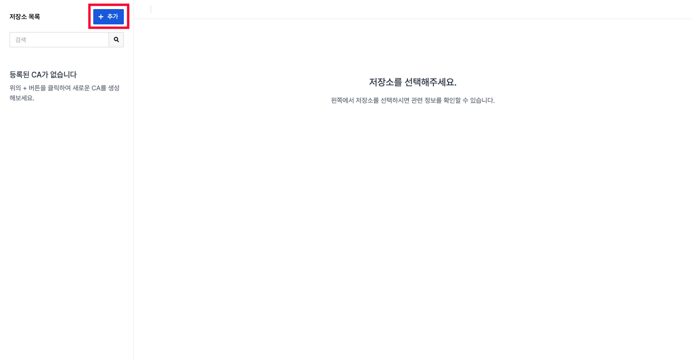

2. 저장소 추가 모달 창에서 다음 정보를 입력합니다.
  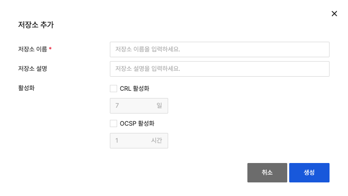
  - **저장소 이름**(필수): 저장소를 식별할 이름을 입력합니다.
  - **저장소 설명**: 저장소에 대한 설명을 입력합니다 (선택 사항).
  - **CRL 활성화**
    - CRL 활성화 여부를 선택합니다.
    - CRL을 활성화하면 갱신 주기를 1~30일 사이로 설정할 수 있습니다.
  - **OCSP 활성화**
    - OCSP 활성화 여부를 선택합니다.
    - OCSP를 활성화하면 갱신 주기를 1~10시간 사이로 설정할 수 있습니다.


3. **[생성]** 버튼을 클릭하여 저장소를 생성합니다.

### 저장소 수정, 삭제

저장소 목록에서 각 저장소 항목의 오른쪽에 있는 메뉴 버튼(⋮)을 클릭하면 다음 작업을 수행할 수 있습니다.
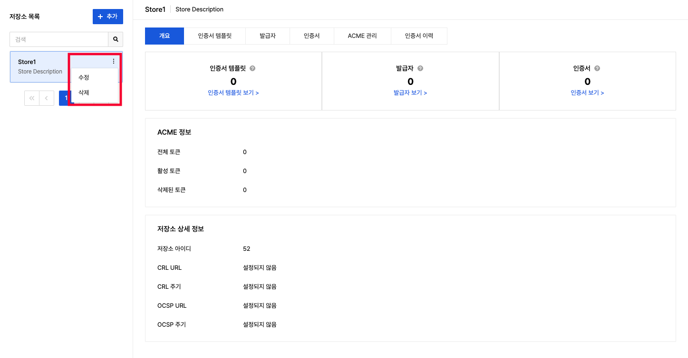

- **수정**: 저장소의 이름, 설명, CRL/OCSP 설정을 변경할 수 있습니다.
- **삭제**: 저장소를 삭제합니다.
  - 저장소를 삭제하면 해당 저장소에 속한 모든 리소스(발급자, 인증서 템플릿, 인증서, ACME 토큰)가 함께 삭제됩니다.
  - 삭제 작업은 되돌릴 수 없으므로 주의가 필요합니다.

### 저장소 개요

왼쪽 CA 목록에서 저장소를 클릭하면 오른쪽 화면에 저장소의 개요가 표시됩니다. 저장소 개요 화면은 탭과 여러 상세 정보들으로 구성되어 있습니다.

#### 탭
//FILL-IN
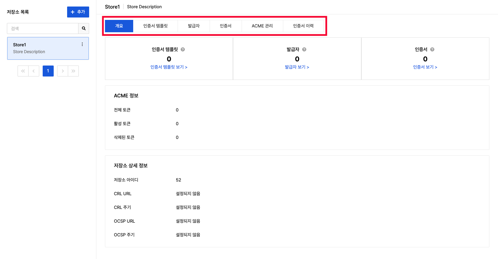

- **개요**: 저장소의 통계 정보와 설정 정보
- **인증서 템플릿**: 인증서 템플릿 목록 및 관리
- **발급자**: 인증서 발급자 목록 및 관리
- **인증서**: 발급된 인증서 목록 및 관리
- **ACME 관리**: ACME 토큰 목록 및 관리
- **인증서 이력**: 저장소의 인증서 이력 확인

#### 리소스 통계 카드

화면 상단에는 저장소의 주요 리소스 수를 표시하는 카드가 3개 나타납니다.
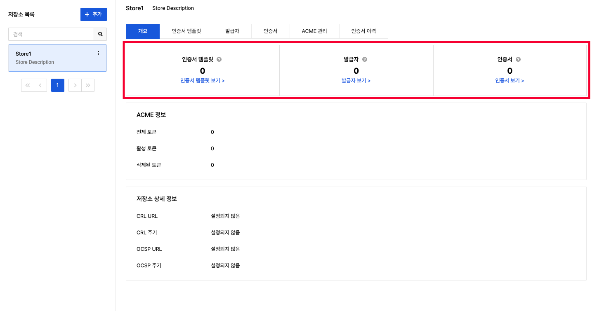

- **인증서 템플릿**: 생성된 인증서 템플릿 총 개수
- **발급자**: 생성된 발급자(Root CA, Intermediate CA) 총 개수
- **인증서**: 발급된 인증서 총 개수

각 카드의 **[보기]** 버튼을 클릭하면 해당 리소스의 관리 탭으로 바로 이동할 수 있습니다.

#### ACME 정보

리소스 카드 하단에는 ACME 정보가 표시됩니다.


- **전체 토큰**: 생성된 ACME 토큰 총 개수
- **활성 토큰**: 활성 상태의 ACME 토큰 개수
- **삭제된 토큰**: 삭제된 ACME 토큰 개수

#### 저장소 상세 정보

ACME 정보 하단에는 저장소 상세 정보가 표시됩니다.
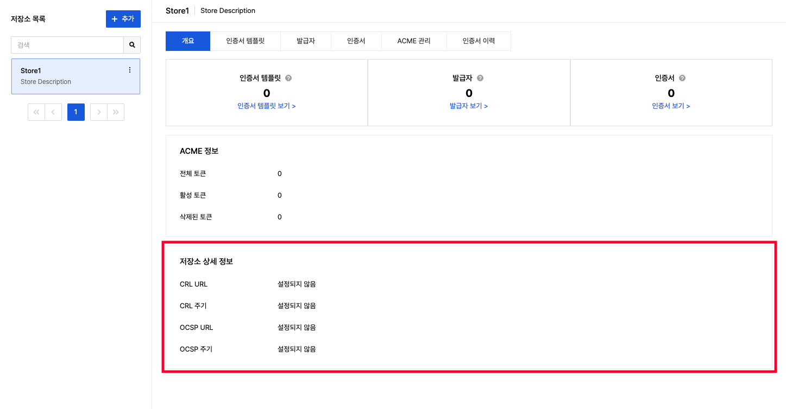

- **CRL URL**: 인증서 폐기 목록(Certificate Revocation List)을 확인할 수 있는 URL
- **CRL 갱신 주기**: CRL이 갱신되는 주기(일 단위)
- **OCSP URL**: OCSP(Online Certificate Status Protocol) 응답자 URL
- **OCSP 갱신 주기**: OCSP 정보가 갱신되는 주기(시간 단위)

> CRL과 OCSP는 인증서의 폐기 상태를 확인하는 방법입니다. CRL은 폐기된 인증서 목록을 제공하며, OCSP는 실시간으로 인증서 상태를 조회할 수 있습니다.

## 발급자

발급자는 인증서를 서명하고 발급하는 인증 기관입니다. Private CA에서는 Root CA와 Intermediate CA 두 가지 유형의 발급자를 생성할 수 있습니다.

### 발급자 목록

발급자 탭에서는 생성된 모든 발급자를 테이블 형태로 확인할 수 있습니다. 테이블에는 다음 정보가 표시됩니다.
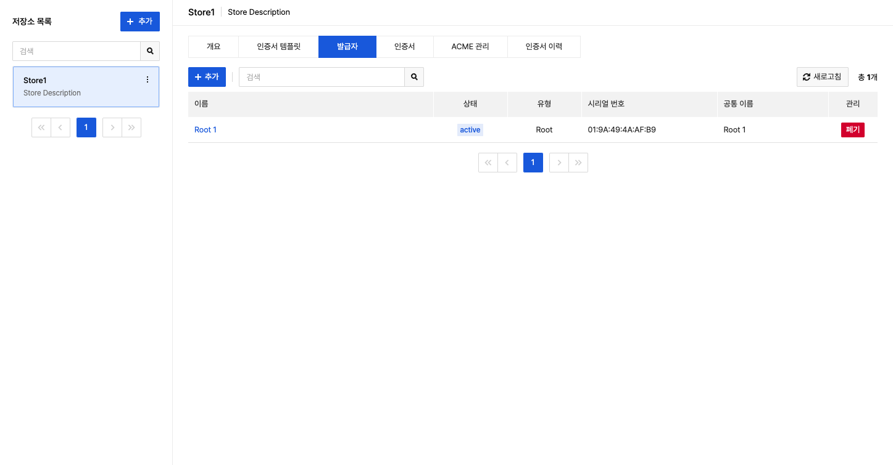

- **이름**: 발급자의 이름
- **상태**: 발급자의 현재 상태
  - **active**: 정상적으로 사용 가능한 상태 (파란색)
  - **revoked**: 폐기된 상태 (빨간색)
- **유형**: Root 또는 Intermediate
- **일련번호**: 인증서의 고유 일련번호
- **Common Name**: 인증서의 공통 이름

각 발급자 항목에는 **[폐기]** 버튼이 있어 필요시 발급자를 폐기할 수 있습니다.

### 발급자 추가

1. 발급자 탭에서 **[+ 추가]** 버튼을 클릭합니다.
  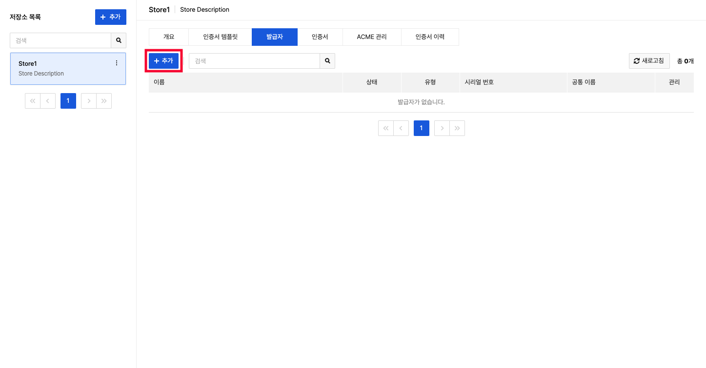


2. 발급자 생성 페이지에서 다음 정보를 입력합니다.
  
  - 기본 정보
    - **인증서 유형**: ROOT 또는 INTERMEDIATE 선택
      - **ROOT**: 최상위 인증 기관으로, 자체 서명된 인증서입니다.
      - **INTERMEDIATE**: 중간 인증 기관으로, ROOT CA에 의해 서명됩니다.
        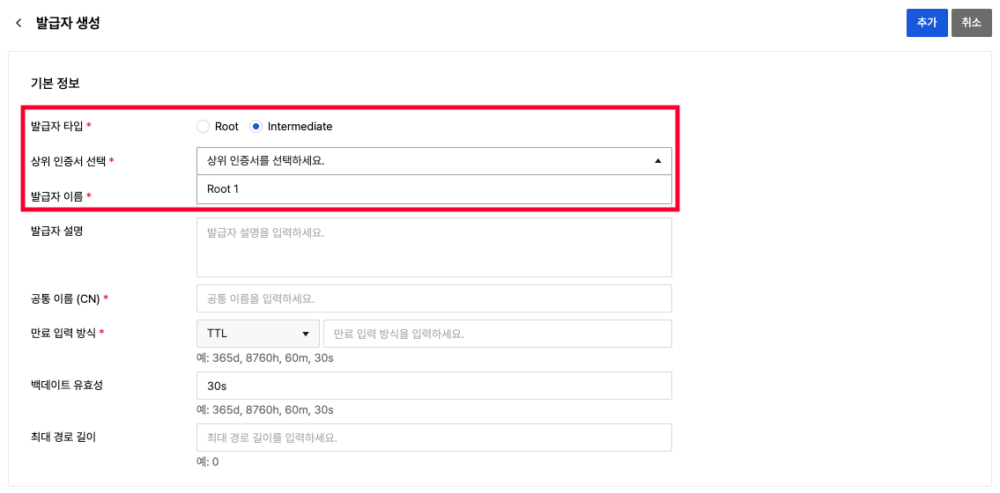
        - **상위 인증서 ID**: INTERMEDIATE 유형을 선택한 경우, 상위 발급자를 선택합니다.
    - **발급자 이름**: 발급자를 식별할 이름 (필수)
    - **발급자 설명**: 발급자에 대한 설명 (선택)
    - **공통 이름 (CN)**: 인증서 공통 이름 (필수)
    - **최대 경로 길이**: 인증서 체인에서 이 발급자 아래에 허용되는 중간 CA의 최대 수를 지정합니다. 0은 더 이상 하위 CA를 생성할 수 없음을 의미합니다. (예: 0)

  - 유효 기간
    - **만료 입력 방식**: TTL 또는 특정 날짜 중 선택
      - **TTL**: 발급 시점부터 지정한 기간 동안 유효 (예: 365d, 8760h, 60m, 30s)
      - **특정 날짜**: 특정 만료 날짜(notAfter)를 지정
    - **백데이트 유효성**: 인증서 유효 시작 시점을 현재 시간보다 이전으로 설정하는 기간입니다. 시간 동기화 문제를 방지하기 위해 사용됩니다. (기본값: 30s, 예: 1d, 24h, 60m, 30s)

  - 키 정보
    - **키 알고리즘**: RSA, EC, ED25519 중 선택
    - **키 비트**: 알고리즘에 따른 키 비트 선택

  - SAN (Subject Alternative Name) 설정
    - **SAN에서 공통 이름 제외**: SAN 목록에서 공통 이름(CN)을 자동으로 제외할지 여부를 선택합니다.
    - **주체(식별자) 일련번호**: 주체의 고유 일련번호를 입력합니다.
    - **주체(식별자) 대체 이름 (SANs)**: 도메인 형식의 추가 식별 이름 (예: example.com, sub.example.com)
    - **IP 주체(식별자) 대체 이름 (IP SANs)**: IP 주소 형식의 추가 식별 이름 (예: 192.168.1.1, 10.0.0.1)
    - **URI 주체(식별자) 대체 이름 (URI SANs)**: URI 형식의 추가 식별 이름 (예: https://example.com, spiffe://example.org)
    - **기타 SANs**: 기타 형식의 SAN (예: 1.2.3.4;UTF8:test@example.com)

  - 주체 정보 (Subject)
    - **Country (C)**: 국가 코드
    - **Locality (L)**: 도시명
    - **State/Province (ST)**: 주 또는 도
    - **Street Address**: 도로명 주소
    - **Postal Code**: 우편번호
    - **Organization (O)**: 기관(조직)
    - **Organization Units(OU)**: 부서(조직 단위)

3. **[추가]** 버튼을 클릭하여 발급자를 추가합니다.

### 발급자 상세 정보

발급자 목록에서 발급자 이름을 클릭하면 상세 정보 페이지로 이동합니다. 상세 페이지에는 다음 정보가 표시됩니다.
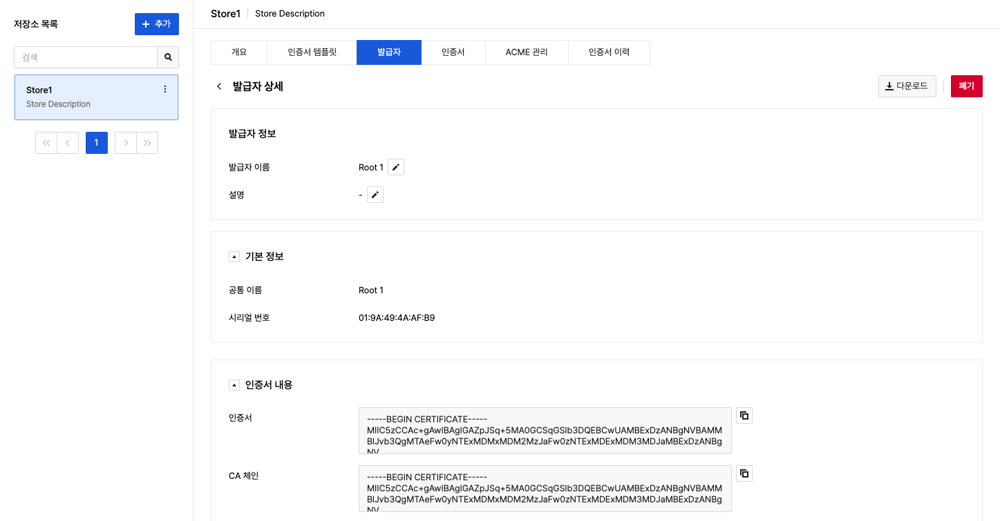

#### 인증서 정보
- 상태, 유형, 일련번호
- 주체 정보 (Subject DN)
- 발급자 정보 (Issuer DN)
- 키 사용 및 확장 키 사용
- 알고리즘 및 키 크기
- 유효 기간 (notBefore, notAfter)
- 지문 (Fingerprint)
- 인증서 PEM 내용

#### 발급자 URL
- **발급 인증서 URL**: 이 발급자가 발급한 인증서 목록
- **CRL 배포 지점**: CRL을 확인할 수 있는 URL
- **OCSP 서버**: OCSP 응답자 URL

### 발급자 수정, 폐기

#### 발급자 수정
발급자 상세 페이지에서 이름과 설명을 직접 수정할 수 있습니다. 수정 후 **[저장]** 버튼을 클릭하여 변경사항을 저장합니다.

- 편집 가능 필드
  - **이름**: 발급자 이름을 수정할 수 있습니다.
  - **설명**: 발급자 설명을 수정할 수 있습니다.

#### 발급자 폐기
1. 발급자 목록에서 폐기할 발급자의 **[폐기]** 버튼을 클릭합니다.
2. 확인 대화상자에서 <strong>[폐기]</strong>를 클릭하여 폐기를 확정합니다.

!!! danger "주의"
    - 발급자를 폐기하면 해당 발급자가 발급한 모든 인증서의 신뢰성에 영향을 미칩니다. 폐기된 발급자는 더 이상 인증서를 발급할 수 없으며, 이미 발급된 인증서는 CRL 또는 OCSP를 통해 폐기 상태를 확인할 수 있습니다.
    - 루트 인증서는 폐기 할 수 없습니다.

## 인증서 템플릿

인증서 템플릿은 인증서를 빠르고 일관성 있게 발급하기 위한 설정의 모음입니다. 인증서 템플릿을 사용하면 동일한 설정으로 여러 인증서를 쉽게 발급할 수 있습니다.

### 인증서 템플릿 목록

인증서 템플릿 탭에서는 생성된 모든 인증서 템플릿을 테이블 형태로 확인할 수 있습니다. 테이블에는 다음 정보가 표시됩니다.
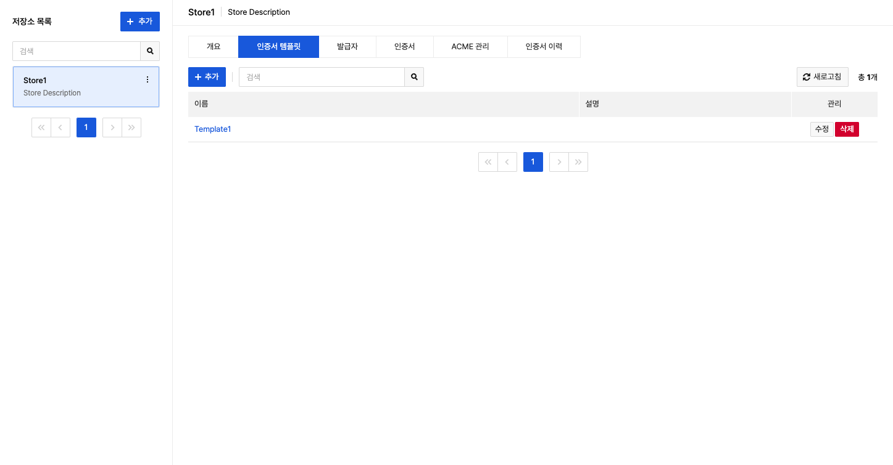

- **이름**: 인증서 템플릿 이름을 클릭하면 상세 정보로 이동합니다.
- **설명**: 인증서 템플릿에 대한 설명

각 인증서 템플릿 항목에는 **[수정]** 및 **[삭제]** 버튼이 있어 인증서 템플릿을 관리할 수 있습니다.

### 인증서 템플릿 추가

1. 인증서 템플릿 탭에서 **[+ 추가]** 버튼을 클릭합니다.
  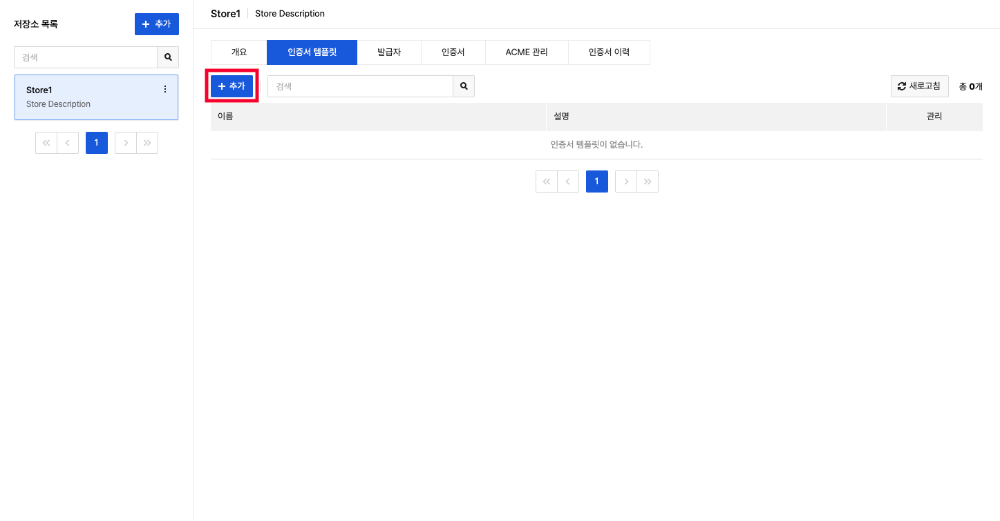

2. 인증서 템플릿 생성 페이지에서 다음 정보를 입력합니다.
  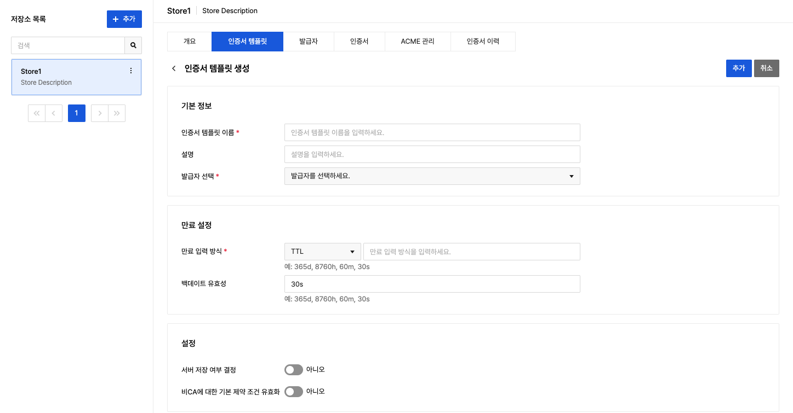

  - 기본 정보
    - **인증서 템플릿 이름**: 인증서 템플릿을 식별할 이름 (필수)
    - **설명**: 인증서 템플릿에 대한 설명 (선택)
    - **발급자 선택**: 이 인증서 템플릿으로 생성된 인증서에 서명할 발급자를 선택합니다.

  - 인증서 유효 기간
    - **만료 입력 방식**: TTL 또는 특정 날짜 중 선택
      - **TTL**: 최대 유효 기간 설정 (예: 365d, 8760h, 60m, 30s)
      - **특정 날짜**: 고정된 만료 날짜(notAfter)를 지정
    - **백데이트 유효성**: 인증서 유효 시작 시점을 현재 시간보다 이전으로 설정하는 기간입니다. 시간 동기화 문제를 방지하기 위해 사용됩니다. (기본값: 30s, 예: 1d, 24h, 60m, 30s)

  - 설정
    - **서버 저장 여부 결정**: 생성된 인증서를 서버에 저장할지 여부를 선택합니다.
    - **비CA에 대한 기본 제약 조건 유효화**: CA가 아닌 인증서에 대해서도 기본 제약 조건을 유효화할지 여부를 선택합니다.

  - 키 파라미터
    - **키 알고리즘**: RSA, EC, ED25519 중 선택
    - **키 비트**: 알고리즘에 따른 키 비트 선택
    - **시그니처 비트**: 인증서 서명에 사용할 해시 알고리즘의 비트 수 선택

  - 키 사용 (Key Usage)
    - **digitalSignature**: 디지털 서명
    - **keyEncipherment**: 키 암호화
    - **keyAgreement**: 키 합의
    - **dataEncipherment**: 데이터 암호화
    - **nonRepudiation**: 부인 방지
    - **keyCertSign**: 인증서 서명 (CA용)
    - **cRLSign**: CRL 서명 (CA용)

  - 확장 키 사용 (Extended Key Usage)
    - **serverAuth**: TLS 서버 인증
    - **clientAuth**: TLS 클라이언트 인증
    - **codeSigning**: 코드 서명
    - **emailProtection**: 이메일 보호
    - **timeStamping**: 타임스탬프
    - **ocspSigning**: OCSP 응답 서명
    - **확장 키 사용 OIDs**: 추가 확장 키 사용 OID를 직접 입력할 수 있습니다. (예: 1.3.6.1.5.5.7.3.1, 1.3.6.1.5.5.7.3.2)

  - SAN 옵션
    - **IP SANs 허용**: IP 주소를 SAN에 포함할 수 있도록 허용합니다.
    - **URI 주체(식별자) 대체 이름 (URI SANs)**: URI 형식의 SAN을 입력합니다. (예: https://example.com, spiffe://example.org)
    - **기타 SANs**: 기타 형식의 SAN을 입력합니다. (예: 1.2.3.4;UTF8:test@example.com)

  - 추가 주체 필드
    - **CSR 공통 이름 사용**: CSR의 CN을 인증서에 그대로 사용할지 여부를 선택합니다.
    - **CSR SANs 사용**: CSR의 SAN을 인증서에 포함할지 여부를 선택합니다.
    - **Country (C)**: 국가 코드
    - **시/도 (ST)**: 주 또는 도
    - **시/군/구 (L)**: 도시명
    - **도로명 주소**: 도로명 주소
    - **우편번호**: 우편번호
    - **기관(조직) (O)**: 조직명
    - **부서(조직 단위) (OU)**: 부서명

3. **[추가]** 버튼을 클릭하여 인증서 템플릿을 추가합니다.

### 인증서 템플릿 상세 정보

인증서 템플릿 목록에서 인증서 템플릿 이름을 클릭하면 상세 정보 페이지로 이동합니다. 상세 페이지는 접을 수 있는 섹션으로 구성되어 있으며, 다음 정보를 확인할 수 있습니다.
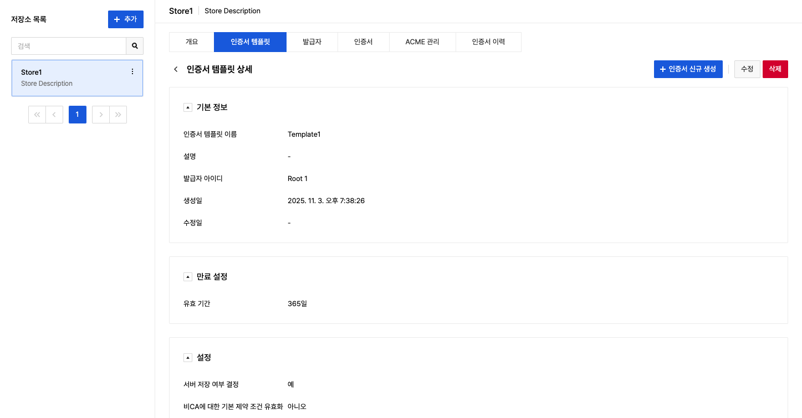

- **기본 정보**: 인증서 템플릿 이름, 설명, 서명 발급자
- **인증서 유효 기간**: 만료 입력 방식(TTL 또는 특정 날짜), 백데이트 유효성
- **설정**: 서버 저장 여부, 비CA에 대한 기본 제약 조건 유효화
- **키 파라미터**: 키 알고리즘, 키 비트, 시그니처 비트
- **키 사용**: 선택된 키 용도 (digitalSignature, keyEncipherment 등)
- **확장 키 사용**: 선택된 확장 키 사용 (serverAuth, clientAuth 등), 추가 OID
- **SAN 옵션**: IP SANs 허용, URI SANs, 기타 SANs
- **추가 주체 필드**: CSR 공통 이름 사용, CSR SANs 사용, 기본값으로 설정된 주체 정보

상세 페이지 상단에는 **[인증서 생성]** 및 **[수정]**, **[삭제]** 버튼이 있습니다.

### 인증서 템플릿 수정, 삭제

#### 인증서 템플릿 수정
1. 인증서 템플릿 목록에서 **[수정]** 버튼을 클릭하거나, 상세 페이지에서 **[수정]** 버튼을 클릭합니다.
  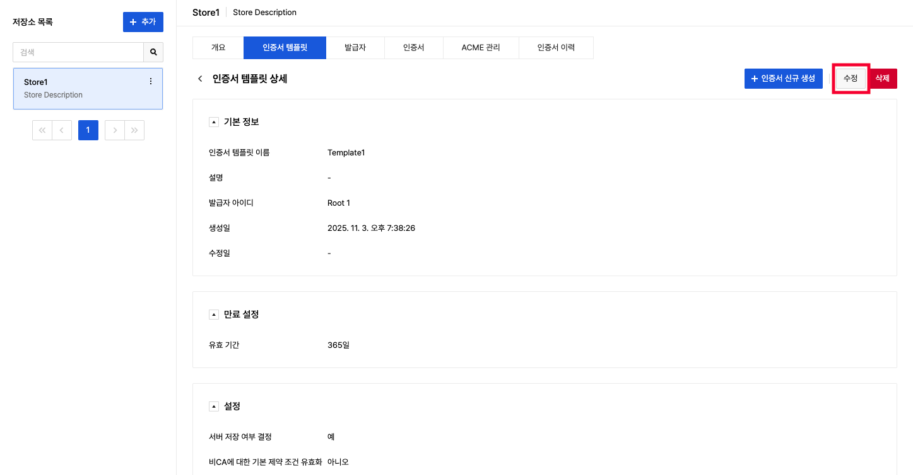
2. 인증서 템플릿 수정 페이지에서 필요한 내용을 변경합니다.
3. **[수정]** 버튼을 클릭하여 변경사항을 저장합니다.

#### 인증서 템플릿 삭제
1. 인증서 템플릿 목록에서 삭제할 인증서 템플릿의 **[삭제]** 버튼을 클릭합니다.
  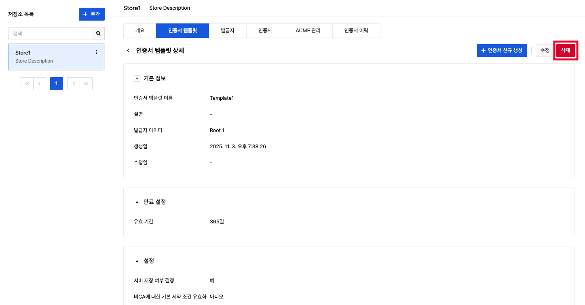
2. 확인 대화상자에서 <strong>[삭제]</strong>를 클릭하여 삭제를 확정합니다.

> **참고**: 인증서 템플릿을 삭제해도 해당 인증서 템플릿으로 이미 생성된 인증서에는 영향을 미치지 않습니다.

### 인증서 템플릿을 통한 인증서 생성

인증서 템플릿을 사용하여 인증서를 생성하는 방법은 다음과 같습니다.

1. 인증서 템플릿 목록에서 사용할 인증서 템플릿을 선택하여 상세 페이지로 이동합니다.
  

2. 상세 페이지 상단의 **[인증서 생성]** 버튼을 클릭합니다.
  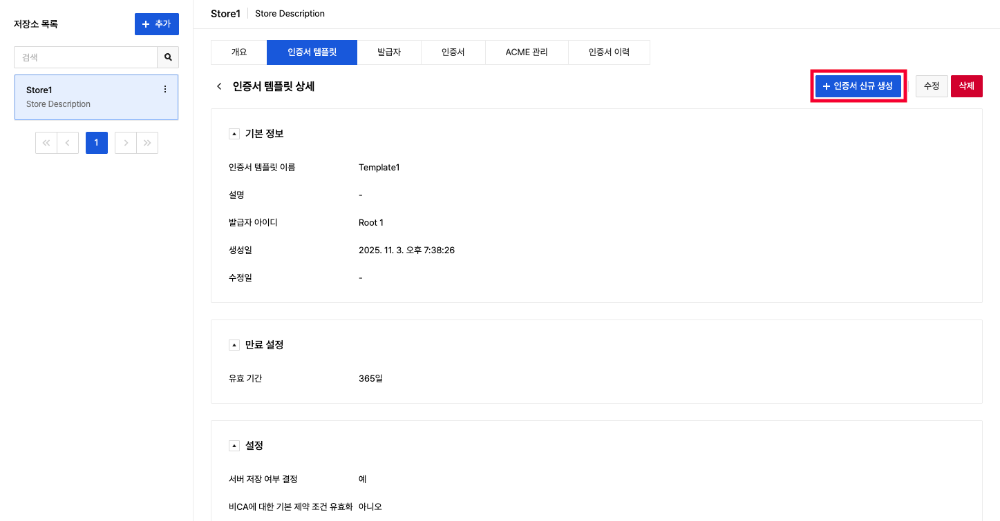

3. 인증서 생성 형태를 선택합니다.
  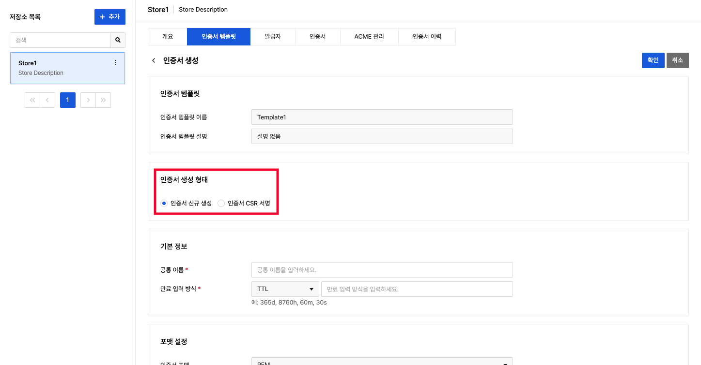
    - **인증서 CSR 서명**을 고를 경우 위와 같이 다른 형태이 입력 폼이 나타납니다
  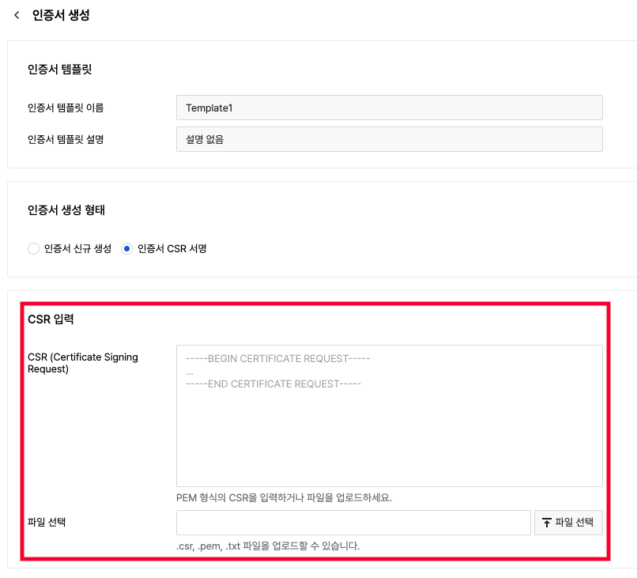

4. 인증서 생성 페이지에서 다음 정보를 입력합니다.
  - **Common Name**: 인증서의 주체 이름 (필수)
  - **SAN 도메인**: 추가 도메인 이름 (선택)
  - **SAN IP**: 추가 IP 주소 (선택)
  - **SAN URI**: 추가 URI (선택)
  - **유효 기간**: 인증서 템플릿의 최대 TTL 범위 내에서 설정
  - 기타 인증서 템플릿에서 허용한 필드

4. **[확인]** 버튼을 클릭하여 인증서를 생성합니다.

생성된 인증서는 사용자의 선택에 따라 Private CA에 저장할 수 있고, 저장한 경우 인증서 탭에서 확인할 수 있습니다.

## 인증서

인증서 탭에서는 저장소에서 발급된 모든 인증서를 조회하고 관리할 수 있습니다.

### 인증서 목록

인증서 탭에서는 발급된 모든 인증서를 테이블 형태로 확인할 수 있습니다. 테이블에는 다음 정보가 표시됩니다.
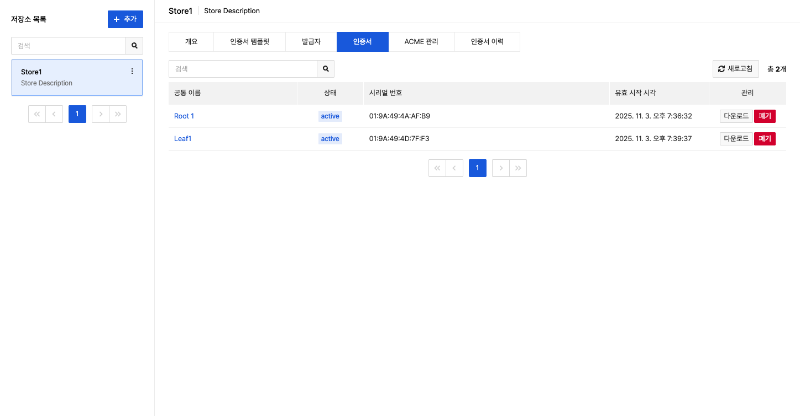

- **공통 이름**: 인증서의 공통 이름을 클릭하면 상세 정보로 이동합니다.
- **상태**: 인증서의 현재 상태
  - **active**: 정상적으로 사용 가능한 상태 (파란색)
  - **revoked**: 폐기된 상태 (빨간색)
- **시리얼 번호**: 인증서의 고유 일련번호
- **유효 시작 시각**: 인증서가 유효하게 된 시점 (notBefore)

각 인증서 항목에는 **[다운로드]** 및 **[폐기]** 버튼이 있어 인증서를 관리할 수 있습니다.

### 인증서 상세 정보

인증서 목록에서 Common Name을 클릭하면 상세 정보 페이지로 이동합니다. 상세 페이지에는 다음 정보가 표시됩니다.
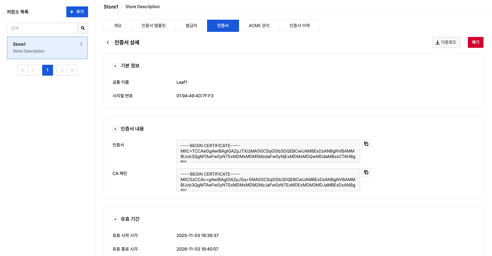

#### 인증서 정보
- **공통 이름**: 인증서의 공통 이름
- **시리얼 번호**: 고유 일련번호
- **인증서**: 인증서 PEM 정보
- **CA 체인**: 체인 인증서 PEM 정보
- **유효 기간**
  - **notBefore**: 인증서가 유효하게 되는 시작 시점
  - **notAfter**: 인증서가 만료되는 시점
- **알고리즘 및 키 크기**: 서명 알고리즘과 키 길이
- **키 사용**: digitalSignature, keyEncipherment 등
- **확장 키 사용**: serverAuth, clientAuth 등

### 인증서 다운로드

인증서를 다운로드하려면 다음과 같이 진행합니다.

1. 인증서 목록에서 다운로드할 인증서의 **[다운로드]** 버튼을 클릭합니다.
  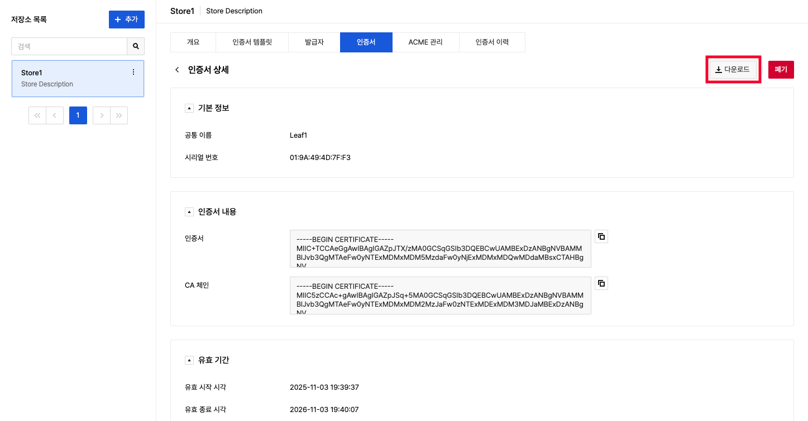
2. 인증서가 PEM 형식으로 다운로드됩니다.

다운로드된 인증서 파일은 웹 서버, 애플리케이션 서버, 로드 밸런서 등에 설치하여 사용할 수 있습니다.

### 인증서 폐기

인증서를 폐기하려면 다음과 같이 진행합니다.

1. 인증서 목록에서 폐기할 인증서의 **[폐기]** 버튼을 클릭합니다.
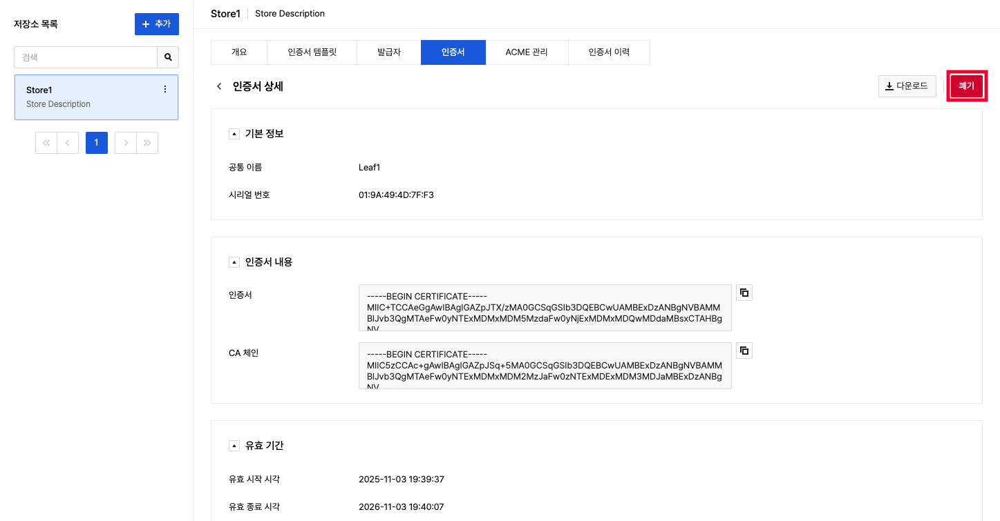
2. 확인 대화상자에서 <strong>[폐기]</strong>를 클릭하여 폐기를 확정합니다.

폐기된 인증서는 더 이상 신뢰할 수 없는 것으로 간주되며, 다음과 같은 방법으로 폐기 상태를 확인할 수 있습니다.

- **CRL (Certificate Revocation List)**: 저장소의 CRL URL을 통해 폐기된 인증서 목록을 확인할 수 있습니다.
- **OCSP (Online Certificate Status Protocol)**: 저장소의 OCSP URL을 통해 실시간으로 인증서 상태를 조회할 수 있습니다.

> **주의**: 인증서 폐기는 되돌릴 수 없는 작업입니다. 폐기된 인증서는 다시 활성화할 수 없으므로, 새로운 인증서를 발급해야 합니다.

## ACME 관리

ACME (Automated Certificate Management Environment)는 인증서 발급 및 갱신을 자동화하는 프로토콜입니다. Private CA의 ACME 관리 기능을 사용하면 Let's Encrypt 클라이언트(예: certbot)와 같은 ACME 클라이언트를 통해 자동으로 인증서를 발급받을 수 있습니다.

### ACME 토큰 목록

ACME 관리 탭에서는 생성된 모든 ACME 토큰을 테이블 형태로 확인할 수 있습니다. 테이블에는 다음 정보가 표시됩니다.
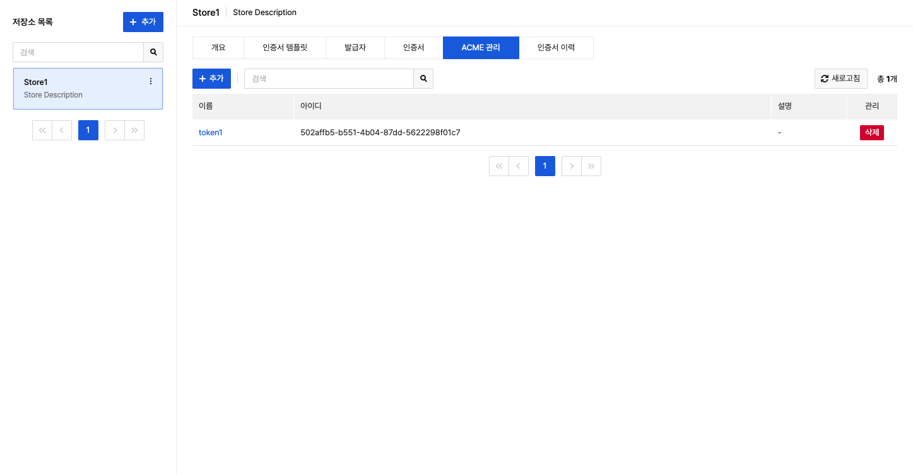

- **이름**: ACME 토큰의 이름을 클릭하면 상세 정보로 이동합니다.
- **아이디**: ACME 토큰 아이디
- **설명**: ACME 토큰에 대한 설명

각 토큰 항목에는 **[삭제]** 버튼이 있어 더 이상 사용하지 않는 토큰을 삭제할 수 있습니다.

### ACME 토큰 추가

1. ACME 관리 탭에서 **[+ ACME 토큰 추가]** 버튼을 클릭합니다.
  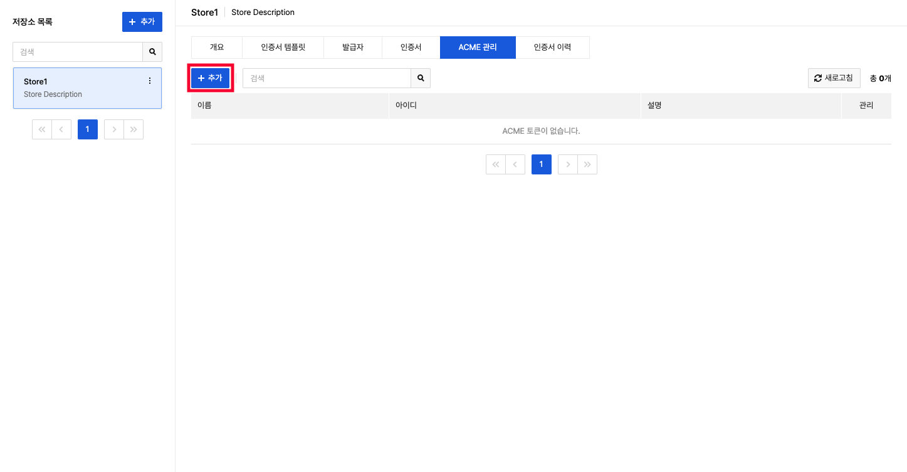

2. ACME 토큰 생성 모달 창에서 다음 정보를 입력합니다.
  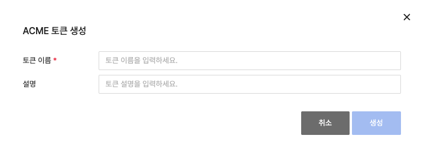
  - **이름** (필수): ACME 토큰을 식별할 이름
  - **설명** (선택): ACME 토큰에 대한 설명

3. **[생성]** 버튼을 클릭하여 토큰을 생성합니다.

#### ACME 토크 생성 완료 후 정보 확인
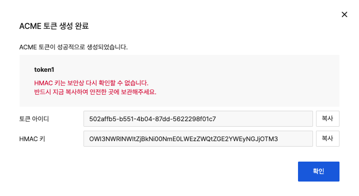
토큰이 생성되면 다음 정보가 표시됩니다.

- **토큰 아이디**: ACME 클라이언트 설정에 사용되는 식별자
- **HMAC 키**: ACME 클라이언트 인증에 사용되는 비밀 키

> **중요**: HMAC Key는 토큰 생성 시 한 번만 표시됩니다. 반드시 안전한 곳에 복사하여 보관해야 하며, 이후에는 다시 확인할 수 없습니다. HMAC Key를 분실한 경우 새로운 토큰을 생성해야 합니다.

### ACME 토큰 상세 정보

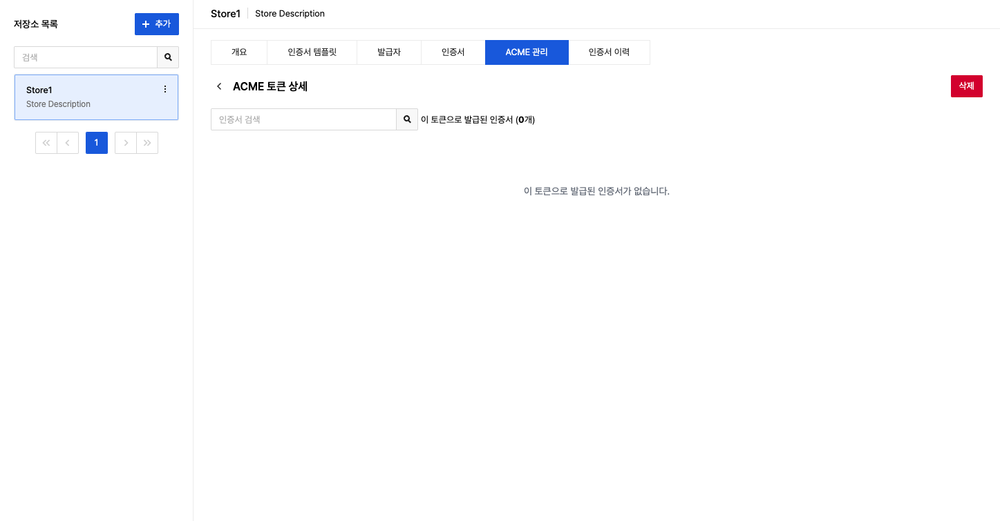
토큰 목록에서 토큰 이름을 클릭하면 상세 정보 페이지로 이동합니다. 상세 페이지에는 다음 정보가 표시됩니다.

#### 발급된 인증서
토큰을 사용하여 발급된 인증서 목록이 표시됩니다. 각 인증서는 다음 정보를 포함합니다.

- **공통 이름**: 인증서 공통 이름
- **상태**: 인증서 상태
- **시리얼 번호**: 인증서 일련번호
- **유효 시작일**: 인증서 유효 시작 날짜

### ACME 클라이언트 설정 예시

생성된 ACME 토큰을 certbot과 함께 사용하는 예시입니다.

```bash
certbot certonly \
  --server https://your-pca-server/acme/directory \
  --eab-kid YOUR_ACME_TOKEN_ID \
  --eab-hmac-key YOUR_ACME_HMAC_KEY \
  -d example.com \
  -d www.example.com
```

### ACME 토큰 삭제

1. ACME 관리 탭에서 삭제할 토큰의 **[삭제]** 버튼을 클릭합니다.
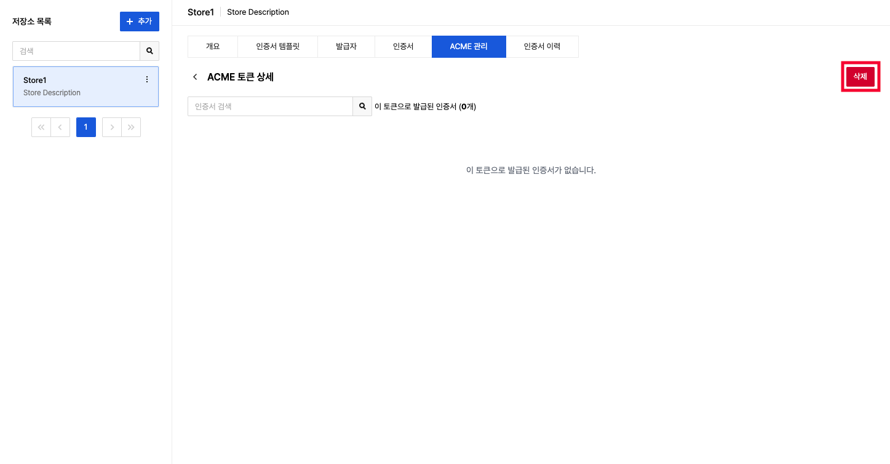

2. 확인 대화상자에서 <strong>[삭제]</strong>를 클릭하여 삭제를 확정합니다.

> **참고**: ACME 토큰을 삭제해도 해당 토큰으로 이미 발급된 인증서에는 영향을 미치지 않습니다. 다만, 해당 토큰을 사용한 자동 갱신은 더 이상 작동하지 않으므로 새로운 토큰을 생성하여 ACME 클라이언트 설정을 업데이트해야 합니다.

## 인증서 이력


인증서 이력 탭에서는 저장소에서 발생한 인증서 관련 활동을 시간순으로 확인할 수 있습니다. 이력에는 다음과 같은 정보가 포함됩니다.

- 발급자, 인증서 생성 이력
- 인증서 폐기 이력

이력 정보를 통해 저장소의 인증서 관리 활동을 추적하고 감사할 수 있습니다.