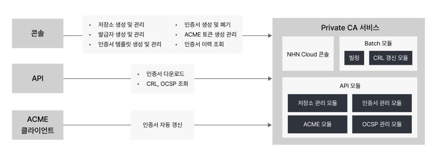

# 개요
**Management > Private CA > 개요**
Private CA는 조직 내부에서 사용하는 인증서를 직접 발급하고 관리할 수 있는 서비스입니다. 공인 인증 기관을 거치지 않고도 안전하게 인증서를 발급하여 내부 시스템, API 서버, IoT 디바이스 등에 적용할 수 있습니다.

## 주요 특징

### 자체 인증 기관(CA) 운영
- Root CA와 Intermediate CA를 생성하여 인증서 계층 구조를 구성할 수 있습니다.
- 조직의 보안 정책에 맞게 인증 기관을 관리하고 운영할 수 있습니다.
- 외부 인증 기관에 의존하지 않고 독립적으로 인증서를 발급할 수 있습니다.

### 인증서 자동 발급 및 갱신
- 인증서 템플릿을 사용하여 동일한 설정의 인증서를 빠르고 일관성 있게 발급할 수 있습니다.
- ACME(automatic certificate management environment) 프로토콜을 지원하여 인증서 발급 및 갱신을 자동화할 수 있습니다.
- Certbot 등의 표준 ACME 클라이언트와 호환됩니다.

### 인증서 폐기 관리
- CRL(certificate revocation list)을 통해 폐기된 인증서 목록을 주기적으로 제공합니다.
- OCSP(online certificate status protocol)를 통해 개별 인증서의 폐기 상태를 요청 시점의 상태로 빠르게 확인할 수 있습니다.
- 인증서 폐기 이력을 추적하고 감사할 수 있습니다.

### API 지원
- RESTful API를 통해 인증서를 프로그래밍 방식으로 관리할 수 있습니다.
- 인증서 다운로드, CRL 조회, OCSP 응답 등의 기능을 API로 제공합니다.
- 자동화 시스템과 쉽게 통합할 수 있습니다.

## 서비스 구성

Private CA 서비스는 다음과 같은 구성 요소로 이루어져 있습니다.

### 저장소
- Private CA를 관리하는 기본 단위입니다.
- 발급자, 인증서 템플릿, 인증서, ACME 토큰 등 모든 리소스는 특정 저장소에 속합니다.
- CRL 및 OCSP 설정을 저장소 단위로 관리합니다.

### 발급자
- 인증서를 서명하고 발급하는 인증 기관입니다.
- **Root CA**: 최상위 인증 기관으로, 자체 서명된 인증서입니다. 모든 신뢰의 출발점이 됩니다.
- **Intermediate CA**: Root CA에 의해 서명된 중간 인증 기관입니다. 실제 서버 인증서 발급에 사용됩니다.

### 인증서 템플릿
- 인증서를 빠르고 일관성 있게 발급하기 위한 설정의 모음입니다.
- 동일한 설정으로 여러 인증서를 쉽게 발급할 수 있으며, 다음 두 가지 설정으로 구성됩니다.
  - **제한 설정**: 유효 기간, SAN 옵션 등 인증서 발급 시 제한 조건을 정의합니다.
  - **공통 반영 설정**: 키 알고리즘, 키 사용 용도, 확장 키 사용 용도, 주체 정보 등 인증서에 공통으로 적용할 설정을 정의합니다.

### 인증서
- 발급자가 서명한 실제 사용 가능한 인증서입니다.
- 서버 인증, 클라이언트 인증, 코드 서명 등 다양한 용도로 사용할 수 있습니다.
- PEM 형식으로 다운로드하여 시스템에 적용할 수 있습니다.

### ACME 토큰
- ACME 프로토콜을 통한 자동 인증서 발급에 사용되는 인증 정보입니다.
- Certbot 등의 ACME 클라이언트와 연동하여 인증서를 자동으로 발급하고 갱신할 수 있습니다.
- 토큰 ID와 HMAC 키를 사용하여 ACME 서버에 인증합니다.

## 인증서 발급 흐름

Private CA에서 인증서를 발급하는 기본 흐름은 다음과 같습니다.

1. **저장소 생성**: 인증서를 관리할 공간을 만듭니다.
2. **발급자 생성**: Root CA 또는 Intermediate CA를 생성합니다.
3. **인증서 템플릿 생성**: 인증서 발급에 사용할 템플릿을 만듭니다.
4. **인증서 발급**: 템플릿을 사용하여 실제 인증서를 발급 받습니다.

발급된 인증서는 PEM 형식으로 다운로드하여 웹 서버, API 서버, 애플리케이션 등에 적용할 수 있습니다.

## 활용 사례

### 내부 시스템 보안 강화
- 조직 내부의 웹 서버, API 서버, 데이터베이스 등에 TLS/SSL 인증서를 발급하여 통신을 암호화할 수 있습니다.
- 내부 인프라에 공인 인증서를 사용할 필요 없이 비용을 절감할 수 있습니다.

### 마이크로서비스 간 인증
- 마이크로서비스 아키텍처에서 서비스 간 상호 인증(mTLS)에 사용할 인증서를 발급할 수 있습니다.
- 서비스 메시(Service Mesh) 환경에서 안전한 통신을 구현할 수 있습니다.

### IoT 디바이스 인증
- IoT 디바이스에 고유 인증서를 발급하여 디바이스 인증 및 통신 보안을 강화할 수 있습니다.
- 대량의 디바이스에 자동으로 인증서를 배포하고 관리할 수 있습니다.

### 개발 및 테스트 환경
- 개발 및 테스트 환경에서 실제 운영 환경과 동일한 인증서 구조를 재현할 수 있습니다.
- 안전한 테스트 환경을 구축하여 보안 취약점을 사전에 발견할 수 있습니다.

### 코드 서명 및 문서 서명
- 소프트웨어 배포 시 코드 서명 인증서를 발급하여 소프트웨어의 무결성을 보장할 수 있습니다.
- 전자 문서에 디지털 서명을 적용하여 문서의 진위를 확인할 수 있습니다.

## 시작하기

Private CA를 처음 사용하는 경우 다음 가이드를 참고할 수 있습니다.

- [콘솔 사용 가이드](./console-guide.md): Private CA 콘솔에서 저장소, 발급자, 인증서 템플릿, 인증서를 생성하고 관리하는 방법을 안내합니다.
- [ACME를 이용한 인증서 갱신](./acme-guide.md): Certbot을 사용하여 인증서를 자동으로 발급하고 갱신하는 방법을 안내합니다.
- [API v2.0 가이드](./api-guide-v2.0.md): API를 통해 인증서를 다운로드하고 CRL, OCSP를 조회하는 방법을 안내합니다.

!!! tip "알아두기"
    - Private CA는 조직 내부용 인증서 발급에 최적화되어 있습니다. 공인 인증서가 필요한 경우 공인 인증 기관을 이용해야 합니다.
    - 발급된 인증서를 사용하려면 클라이언트 시스템에 CA 체인을 신뢰할 수 있는 인증서로 등록해야 합니다.
    - ACME 프로토콜을 사용하면 인증서 발급 및 갱신을 완전히 자동화할 수 있어 운영 부담을 크게 줄일 수 있습니다.

!!! danger "주의"
    - 인증서 폐기는 되돌릴 수 없는 작업입니다. 신중하게 결정해야 합니다.
    - CRL 및 OCSP를 활성화하여 폐기된 인증서를 클라이언트가 확인할 수 있도록 설정해야 합니다.
